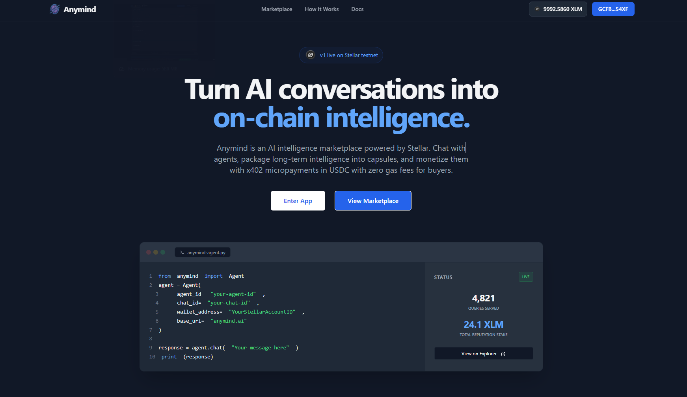

# Anymind 🧠

**Anymind is an AI agent runtime for creating, monetizing, and distributing intelligence.**

It enables developers and creators to build stateful AI agents, package their intelligence into reusable memory capsules, and monetize access through programmable micropayments.

Built across **AI infra + Web3 rails + developer tooling**, Anymind combines:

- **Stellar** for wallet-authenticated identity, on-chain staking, and reputation
- **Soroban** smart contracts for capsule creation, staking, and earnings
- **Stellar x402** for USDC micropayments with sponsored fees
- **FastAPI + Supabase + Redis** for backend orchestration and state
- **React + Vite** for a fast, wallet-native frontend
- **Python SDK** for programmatic agent access

---



## Why Anymind?

Most AI products stop at conversations.

Anymind extends intelligence beyond a single session.

With Anymind, intelligence can be:

- **created** as custom agents
- **persisted** as memory capsules
- **published** to a marketplace
- **queried** through paid access
- **staked** on-chain for reputation and discovery
- **integrated** via SDKs into external applications

This turns agents from temporary chats into **long-lived economic entities**.

---

## Core Product Flows

### 1. Agent Creation

Create custom AI agents with provider-backed inference.

Agents support:

- custom prompts
- provider credentials
- session memory
- stateful backend interaction
- wallet-aware identity
- on-chain registration via Soroban

### 2. Memory Capsules

Agent outputs and learned context can be packaged into **memory capsules**.

Each capsule includes:

- metadata
- ownership
- pricing
- access permissions
- creator reputation
- marketplace visibility

Think of capsules as **portable intelligence assets** anchored on-chain.

### 3. Marketplace

Capsules can be published and monetized through the marketplace.

Users can:

- browse capsules
- discover creators
- query paid intelligence
- access premium agent memory

### 4. Payment Rails

Anymind supports dual payment paths.

#### Preferred: Stellar x402 + USDC

Fast programmable micropayments with sponsored fees.

Flow:

```
Client request
→ 402 Payment Required
→ wallet signature
→ X-PAYMENT header
→ facilitator settlement
→ response delivery
```

#### Wallet Flow

Stellar Wallets Kit powers connection, account identity, and signing across the frontend.

### 5. Staking + Reputation

Staking is recorded on-chain via the Anymind Soroban contract on Stellar testnet.

Staking powers:

- reputation scoring
- marketplace ranking
- creator trust
- discovery visibility

On first stake, a **capsule** is created on-chain for the agent. Subsequent stakes accumulate on the same capsule. Earnings can be withdrawn on-chain via `withdraw_earnings`.

---

## Tech Stack

### Frontend

- React 18
- TypeScript
- Vite
- Tailwind CSS
- Stellar Wallets Kit
- `@stellar/stellar-sdk` (contract client)

### Backend

- FastAPI
- Supabase
- Upstash Redis / Vercel KV
- Mem0
- Tavily
- provider-based LLM integrations

### Blockchain + Payments

- Stellar testnet
- Soroban smart contract (`contracts/`)
- TypeScript bindings (`bindings/`)
- Stellar x402
- OpenZeppelin Channels facilitator

---

## Repository Structure

```text
.
├── src/                       Frontend application
│   ├── components/            Shared UI components
│   ├── contexts/              Wallet + global state
│   ├── hooks/
│   │   ├── useContract.ts     Soroban contract hook (stake, register, earnings)
│   │   └── ...
│   ├── lib/
│   │   ├── contract.ts        AnymindClient + signing factory
│   │   ├── api.ts             Backend REST client
│   │   └── ...
│   ├── pages/                 Main product screens
│   └── utils/                 Payments + helpers
│
├── contracts/                 Soroban smart contract (Rust)
│   └── src/lib.rs             register_agent, create_capsule, stake_on_capsule,
│                              withdraw_earnings, update_capsule_price
│
├── bindings/                  Auto-generated TypeScript contract bindings
│   └── src/index.ts           Typed Client + ContractSpec XDR
│
├── backend/                   FastAPI backend
│   ├── app/
│   │   ├── api/               REST endpoints
│   │   ├── core/              Settings + auth
│   │   ├── db/                Database setup
│   │   ├── models/            Pydantic schemas
│   │   └── services/          Core business logic
│   └── supabase/              SQL migrations
│
├── anymind-sdk/               Python SDK
└── vercel.json
```

---

## Smart Contract

The Anymind contract is deployed on **Stellar testnet**.

**Contract ID:** `CBD3R6PVDQ5PDDSNV344HZQQXYAAXOIZSEDRYXIPD3KRV5MPCLDOGVPJ`

### Methods

| Method | Description |
|---|---|
| `register_agent` | Register an AI agent on-chain |
| `create_capsule` | Create a memory capsule with pricing |
| `stake_on_capsule` | Stake XLM on a capsule (min 0.1 XLM, max 100,000 XLM) |
| `withdraw_earnings` | Withdraw accumulated query earnings |
| `update_capsule_price` | Update the price per query for a capsule |

### Build + Deploy

```bash
cd contracts
cargo build --target wasm32-unknown-unknown --release
stellar contract deploy \
  --wasm target/wasm32-unknown-unknown/release/anymind.wasm \
  --network testnet
```

### Bindings

The `bindings/` package contains auto-generated TypeScript bindings for the contract.
The frontend uses them inline via `src/lib/contract.ts` (no separate build step required).

```ts
import { createSignedClient } from './lib/contract'

const client = createSignedClient(walletPublicKey)
const tx = await client.stake_on_capsule({ staker, capsule_id, amount })
await tx.signAndSend()
```

---

## Local Development Setup

### Prerequisites

- Node.js 18+
- npm
- Python 3.9+
- Supabase project
- Redis / Upstash / Vercel KV
- LLM provider API key
- Freighter or another Stellar-compatible wallet (for on-chain features)

---

### 1. Install Frontend

```bash
npm install
```

### 2. Install Backend

```bash
cd backend
pip install -r requirements.txt
```

### 3. Configure Environment Variables

**Frontend** (`.env`):

```env
VITE_API_BASE_URL=http://localhost:8000
```

**Backend** (`.env`):

```env
DEBUG=True
HOST=0.0.0.0
PORT=8000

SUPABASE_SERVICE_KEY=...
OPENROUTER_API_KEY=...
MEM0_API_KEY=...
TAVILY_API_KEY=...

STELLAR_HORIZON_URL=https://horizon-testnet.stellar.org
STELLAR_PAY_TO_ADDRESS=...
STELLAR_NETWORK=stellar:testnet
FACILITATOR_URL=https://channels.openzeppelin.com/x402/testnet
```

Use `env.example` and `backend/env.example` as reference templates.

### 4. Run Backend

```bash
cd backend
python main.py
```

Runs at `http://localhost:8000`

### 5. Run Frontend

```bash
npm run dev
```

Runs at `http://localhost:8080`

---

## Frontend Commands

| Command | Description |
|---|---|
| `npm run dev` | Start dev server |
| `npm run build` | Production build |
| `npm run preview` | Preview build |
| `npm run lint` | ESLint |
| `npm run typecheck` | TypeScript checks |

---

## Backend API

- `/docs` — Swagger UI
- `/redoc` — ReDoc
- `/health` — Health check

### Route Groups

- `/api/v1/agents`
- `/api/v1/capsules`
- `/api/v1/marketplace`
- `/api/v1/wallet`
- `/api/v1/auth`
- `/api/v1/preferences`

---

## Python SDK

The `anymind-sdk/` package enables agent access from scripts, external backends, automations, and third-party products.

---

## Deployment

### Frontend

- Vercel (`vercel.json` included)

### Backend

- Render (`backend/render.yaml`)
- Docker (`backend/Dockerfile`)

---

## Known Gotchas

- Frontend requires `VITE_API_BASE_URL`
- Backend expects Supabase + Redis for full functionality
- Advanced memory flows degrade gracefully without optional services
- On-chain staking requires a Stellar-compatible wallet (Freighter, Lobstr, etc.)
- Contract amounts are in stroops (1 XLM = 10,000,000 stroops); the frontend converts automatically
- PowerShell may require `npm.cmd` instead of `npm`

---

## Vision

Anymind is building toward an **agentic internet** where intelligence is no longer session-bound.

Instead of isolated prompts, intelligence becomes:

- persistent
- composable
- monetizable
- portable
- economically native

The long-term goal is to make AI agents function like programmable digital entities.
